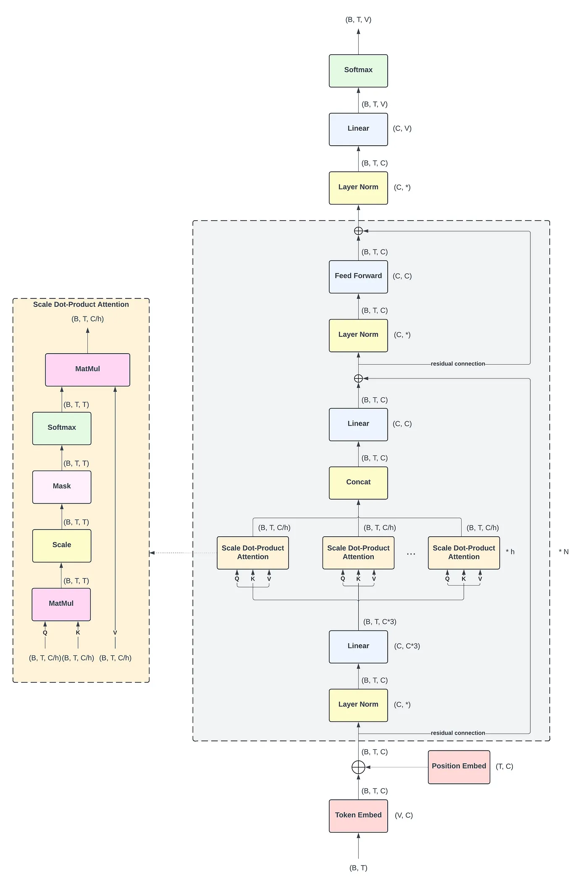
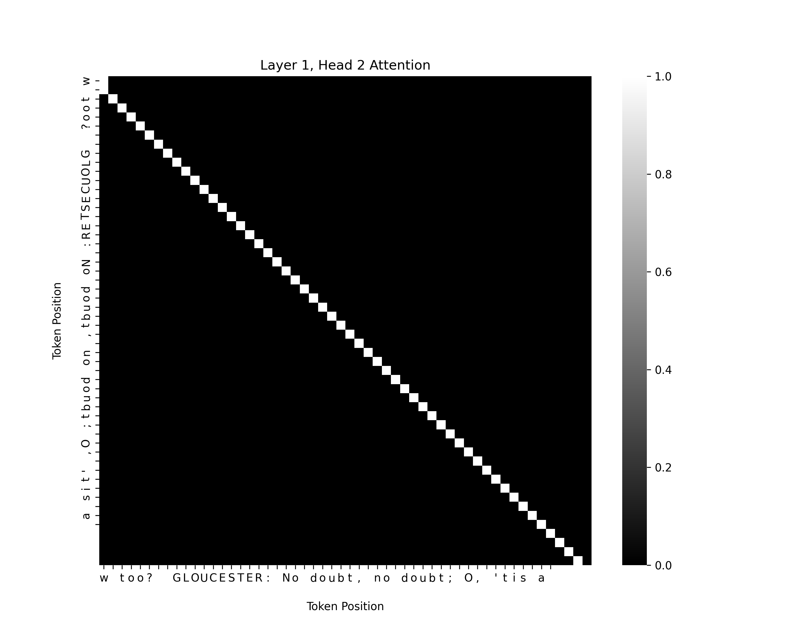

## GPT-2 Language Modeling: English & Hebrew




This project implements a transformer-based language model inspired by GPT-2.

The model is trained separately on two datasets:
- English: Shakespeare's works
- Hebrew: A Hebrew language corpus


The results of the models can be found in [results.pdf](./results.pdf).



The heatmap below shows the attention scores from Layer 1, Head 2 on a sample from the Shakespeare dataset.
Brighter values indicate stronger attention. The strong diagonal reflects high attention to the previous token, as expected in causal language modeling.

Perfect — based on your script and config, here’s a clean **“Running the Code”** section in the same format as before, tailored for your **GPT-2 Language Modeling repo**:

---

## Running the Code

To train the Transformer-based GPT-2 language model on Hebrew or English text:

```bash
python main.py
```

Make sure your configuration file is defined in [conf/conf.json](./conf/conf.json).

### Example `conf.json`

```json
{
  "seq_len": 128,
  "batch_size": 64,
  "data_path": "data/heb-data/",
  "n_layers": 8,
  "n_heads": 8,
  "embed_size": 192,
  "learning_rate": 5e-4,
  "gradient_clipping": 1.0,
  "weight_decay": 1e-4,
  "num_batches_to_train": 50000
}
```

To train on English data, just change the `data_path` to `"data/eng-data/"`.

---

### Output Files

- Model Checkpoint:
  After training, the model’s weights will be saved as:
  ```
  model_weights.pth
  ```

- Generated Samples:
  During training, the model occasionally generates and logs example sequences from the current model state.

  Example log output:
  ```
  Model sample: '''To be, or not to be: that is the question...'''
  ```

  Samples are generated every 100 batches using a custom `better_sample_continuation` method.
  This method takes a prompt (prefix) and generates new tokens one-by-one, applying:

    - Temperature scaling to control randomness (lower = more deterministic).

    - Top-K sampling to only choose from the top K most probable next tokens, improving quality and coherence.