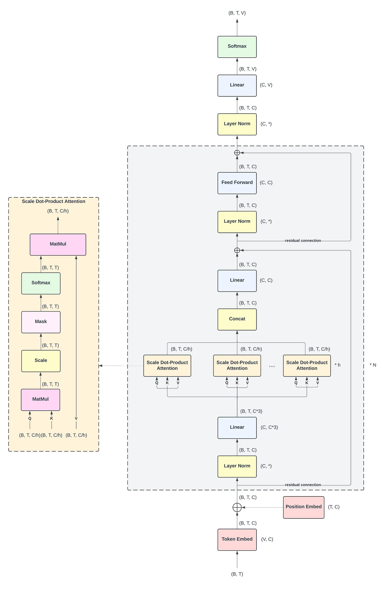
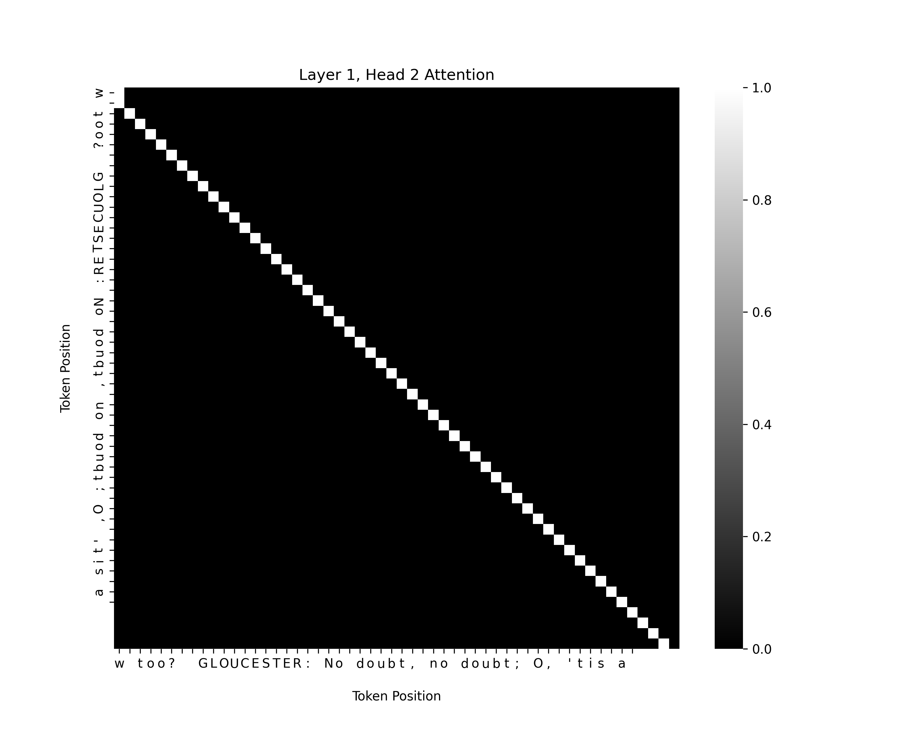

GPT-2 Language Modeling: English & Hebrew




This project implements a transformer-based language model inspired by GPT-2.

The model is trained separately on two datasets:
- English: Shakespeare's works
- Hebrew: A Hebrew language corpus


The results of the models can be found in [results.pdf](./results.pdf).



The heatmap below shows the attention scores from Layer 1, Head 2 on a sample from the Shakespeare dataset.
Brighter values indicate stronger attention. The strong diagonal reflects high attention to the previous token, as expected in causal language modeling.

## Running the code
1. You can install the required libraries running
    ```bash
    pip install -r requirements.txt
    ```
2. Run:
    ```bash
    python3 main.py
    ```

